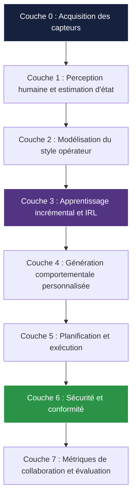
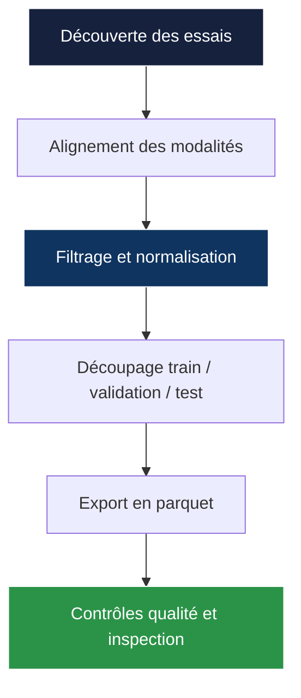
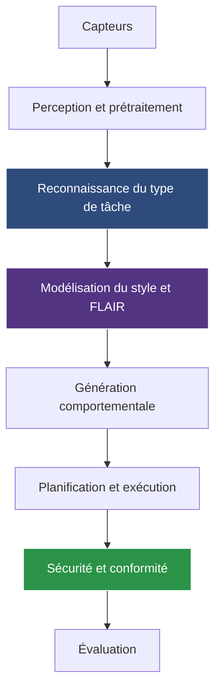

# Collaboration Humain-Robot
## Apprentissage incrémental, adaptation comportementale et sécurité pour les cobots

**Auteur :** Ameur Gargouri  
**Projet :** Thèse de doctorat  
**Date :** 2026-07-03

---

# Résumé exécutif

Cette thèse vise à doter un cobot de capacités d'adaptation progressive face à la variabilité des opérateurs humains, tout en garantissant une exécution sûre et interprétable.

L'idée centrale est la suivante : apprendre à partir de la collaboration réelle, conserver les connaissances acquises, adapter le comportement du robot à chaque opérateur, et maintenir la sécurité comme contrainte permanente.

---

# Problématique scientifique

## Question de recherche

Comment un cobot peut-il apprendre de manière incrémentale les préférences, les stratégies et le style opératoire d'un humain, puis transformer cet apprentissage en un comportement personnalisé sans reprogrammation explicite ?

## Défi principal

La difficulté n'est pas seulement la précision prédictive. Elle réside dans l'équilibre entre :

- l'adaptation rapide à de nouveaux opérateurs,
- la rétention des connaissances antérieures,
- la robustesse aux signaux multimodaux bruités,
- la sécurité de l'interaction homme-robot.

---

# Axes de recherche

## Quatre objectifs structurants

| Axe | Objectif | Rôle dans la thèse |
|---|---|---|
| A1 — Modélisation des schémas opératoires humains | Apprendre les habitudes, les séquences et le timing | Représenter le style d'un opérateur |
| A2 — Apprentissage incrémental et IRL | Inférer les préférences en ligne à partir des démonstrations et corrections | Réduire l'oubli catastrophique |
| A3 — Génération comportementale personnalisée | Produire des trajectoires et rythmes adaptés à l'opérateur | Passer de la perception à l'action |
| A4 — Alignement et fluidité | Mesurer objectivement l'adéquation homme-robot | Évaluer la qualité de la collaboration |

---

# Contributions majeures

## Ce qui a été réalisé

- Une architecture de thèse complète, de l'acquisition des signaux à l'évaluation.
- Une chaîne de prétraitement reproductible pour HARMONIC, DASIG et MultiPhysio-HRC.
- Un système de reconnaissance du type de tâche sur MultiPhysio-HRC.
- FLAIR, un nouvel algorithme incrémental hybride pour l'autonomie partagée.
- Un système de détection de sécurité sur DASIG, avec modèles profonds 1D de haut niveau.
- Une base de travail pour la fusion multimodale et l'adaptation comportementale à long terme.

## Message central

La thèse ne consiste pas en une seule expérience, mais en une chaîne cohérente de résultats qui démontrent qu'une adaptation incrémentale, sûre et personnalisée est réalisable dans des scénarios HRC réalistes.

---

# Architecture générale de la thèse

## Principe directeur

Chaque couche est testable indépendamment, mais la valeur scientifique de la thèse provient de leur articulation : perception, style, adaptation, exécution et sécurité sont traités comme un système unique.

---

# Données et prétraitement

### Contribution principale

J'ai construit des pipelines reproductibles de prétraitement pour HARMONIC, DASIG et MultiPhysio-HRC afin d'assurer une base expérimentale propre, stable et comparable pour les études suivantes.

## Jeux de données utilisés

| Jeu de données | Rôle | Modalités principales |
|---|---|---|
| HARMONIC | Apprentissage incrémental et autonomie partagée | Joystick, état robot, regard, EMG, IMU, vidéo |
| DASIG | Détection d'état de sécurité | Signaux MIMU et cinématiques |
| MultiPhysio-HRC | Estimation du stress, de la charge et du type de tâche | EEG, ECG, EDA, EMG, respiration, audio, vidéo |

## Preuves de prétraitement

| Pipeline | Entrée | Traité avec succès | Taux de succès |
|---|---:|---:|---:|
| HARMONIC | 447 essais | 447 | 100 % |
| DASIG | 180 enregistrements | 179 | 99,4 % |
| MultiPhysio-HRC | 5 640 échantillons fusionnés | 5 640 | 100 % |

La seule erreur sur DASIG provenait d'un CSV brut mal formé, et non du code de prétraitement.

---

# Flux de prétraitement HARMONIC

## Intérêt scientifique

Ce pipeline transforme des données multimodales hétérogènes en une base propre, stable et reproductible, indispensable pour comparer des stratégies d'apprentissage incrémental dans des conditions équitables.

---

# Couche 1 — Perception humaine

## Reconnaissance du type de tâche sur MultiPhysio-HRC

### Contribution principale

À partir du jeu MultiPhysio-HRC, nous avons développé un système compact de détection du type de tâche pour la collaboration homme-robot, fondé sur des caractéristiques physiologiques fusionnées et évalué sur une classification à cinq classes.

Le pipeline suit une logique simple et reproductible : prétraitement, fusion tabulaire, apprentissage sensible au déséquilibre, puis évaluation sur un split stratifié 80/20.

## Étiquettes de tâche

- charge cognitive
- stress élevé
- tâche industrielle
- faible charge
- autre

### Résultats principaux

| Modèle | Exactitude | Accuracy équilibrée | Macro-F1 |
|---|---:|---:|---:|
| XGBoost | 0.9371 | 0.8943 | 0.9142 |
| Random Forest | 0.9211 | 0.8552 | 0.8836 |
| MLP | 0.9140 | 0.8727 | 0.8727 |
| Two-Tower Fusion | 0.8874 | 0.8908 | 0.8635 |
| Régression logistique | 0.7739 | 0.7164 | 0.6730 |

## Lecture des résultats

XGBoost fournit le meilleur compromis entre performance globale et robustesse par classe. La classe la plus difficile reste la faible charge, tandis que les meilleures performances sont obtenues sur tâche industrielle et autre.

---

# Couche 2 — Modélisation du style opérateur

## Rôle dans l'architecture

Cette couche vise à résumer le comportement d'un opérateur en une représentation compacte de style, qui pourra conditionner les modules d'adaptation, de génération et de planification.

## Interprétation

L'idée n'est pas seulement de prédire un état, mais de construire une mémoire structurée du comportement humain : séquences, stratégies, préférences et signatures individuelles.

Cette représentation sert ensuite de point d'entrée à l'apprentissage incrémental et à la génération personnalisée.

---

# Couche 3 — FLAIR

## Algorithme incrémental proposé

FLAIR est l'apport algorithmique central de la thèse pour l'autonomie partagée. Il combine :

- la modulation FiLM spécifique à la tâche,
- la mémoire rejouée sensible à l'identité de tâche,
- la régularisation d'importance basée sur Fisher,
- RetroBoost,
- l'initialisation à chaud des couches FiLM,
- un mélange adaptatif entre tête partagée et têtes spécifiques.

## Idée clé

Au lieu de choisir entre régularisation, replay ou séparation architecturale, FLAIR les combine dans un seul cadre incrémental, ce qui améliore simultanément la stabilité et la plasticité.

---

# FLAIR — Résultats sur l'autonomie partagée

## Benchmark séquentiel HARMONIC

Dans ce benchmark, l'ACC correspond au coefficient de détermination $R^2$.

| Méthode | ACC | F | BWT | FWT | Mémoire (Mo) | Temps (s) |
|---|---:|---:|---:|---:|---:|---:|
| FLAIR (proposé) | 0.6895 | 0.0168 | -0.0168 | 0.1175 | 1.28 | 554.5 |
| Joint Training | 0.6442 | 0.0365 | -0.0044 | 0.0130 | 1664.2 | 7895.0 |
| DER++ | 0.6120 | 0.1480 | -0.1480 | 0.1720 | 0.9 | 154.0 |
| Online EWC | 0.4150 | 0.2110 | -0.2110 | 0.0830 | 0.5 | 124.0 |
| EWC | 0.3680 | 0.2750 | -0.2750 | 0.0040 | 5.39 | 264.0 |
| A-GEM | 0.4200 | 0.3760 | -0.3760 | -0.0490 | 0.2 | 167.0 |

## Conclusion expérimentale

FLAIR est la meilleure contribution algorithmique du benchmark séquentiel : il améliore la précision finale, limite fortement l'oubli, et conserve une empreinte mémoire très faible par rapport au réentraînement joint.

---

# FLAIR — Éléments de preuve

## Ce que montrent les figures

- FLAIR domine parmi les méthodes hybrides.
- Les mécanismes architecturaux ont un effet réel et cumulatif.
- Le gap avec l'upper bound hors-ligne se réduit fortement.
- La rétention sur les utilisateurs déjà vus reste stable.

---

# FLAIR — Ablation

## Contribution principale

L'étude d'ablation montre que FLAIR fonctionne parce que plusieurs mécanismes se renforcent mutuellement : FiLM, replay, régularisation d'importance, RetroBoost, warm-start et pondération adaptative du replay.

## Lecture scientifique

- La configuration de base est déjà compétitive.
- RetroBoost et FiLM warm-start réduisent l'oubli.
- La pondération adaptative stabilise l'apprentissage sous dérive de tâches.
- La configuration complète offre le meilleur compromis global.

---

# Couche 6 — Sécurité et conformité

## Détection des gestes abrupts sur DASIG

### Contribution principale

Le système de sécurité détecte les gestes abrupts ou dangereux pour permettre au cobot de ralentir ou de s'arrêter avant une situation à risque.

## Pourquoi c'est critique

La sécurité n'est pas un module secondaire : elle borne l'espace des comportements admissibles du robot et reste active en permanence.

---

# Résultats sécurité

| Modèle | Exactitude | Macro-F1 | Rappel danger | Précision danger |
|---|---:|---:|---:|---:|
| ConvNeXt 1D | 99.43 % | 98.68 % | 97.13 % | 98.25 % |
| TCN | 99.41 % | 98.62 % | 97.14 % | 98.04 % |
| MLP-Mixer 1D | 99.28 % | 98.32 % | 95.88 % | 98.27 % |
| InceptionTime | 98.30 % | 96.22 % | 97.53 % | 89.62 % |
| Transformer 1D | 96.47 % | 92.50 % | 95.85 % | 79.71 % |

## Conclusion

ConvNeXt 1D constitue le meilleur compromis final, avec une excellente capacité de détection de l'état dangereux et une très bonne précision sur la classe danger.

---

# Matrices de confusion sécurité

## Lecture

- Les faux positifs restent faibles pour les meilleurs modèles.
- La classe danger est détectée de manière robuste.
- ConvNeXt 1D et TCN apparaissent comme les meilleures solutions profondes.

## Interprétation

Les modèles classiques sont utiles pour l'interprétation, mais ils restent nettement inférieurs aux meilleurs modèles profonds 1D sur cette tâche de sécurité.

---

# Synthèse intégrée

## Message scientifique

Les différentes contributions ne sont pas isolées. Elles forment une chaîne complète :

- perception de l'état humain,
- représentation du style opérateur,
- adaptation incrémentale via FLAIR,
- génération et contrôle,
- sécurité garantie,
- évaluation quantitative.

---

# Contributions validées

## Ce que les résultats démontrent

- Le prétraitement est reproductible sur les trois jeux de données.
- MultiPhysio-HRC permet une détection fiable du type de tâche.
- FLAIR apporte une amélioration concrète sur l'autonomie partagée séquentielle.
- La sécurité peut être apprise avec une performance très élevée sur DASIG.
- L'architecture globale de thèse est cohérente du signal brut à l'évaluation.

---

# Limites et perspectives

## Limites

- Certaines couches de la thèse restent principalement architecturales et demandent une validation longitudinale plus large.
- Les résultats sont solides sur les jeux de données étudiés, mais la généralisation à d'autres contextes HRC doit être confirmée.
- FLAIR requiert encore une évaluation plus étendue sur d'autres scénarios incrémentaux et des conditions plus bruitées.

## Perspectives

- étendre l'apprentissage incrémental à des scénarios plus ouverts,
- intégrer une inférence plus fine du style opérateur,
- relier plus directement la perception à la génération comportementale,
- valider le système en environnement réel avec plusieurs opérateurs.

---

# Conclusion

Cette thèse montre qu'un cobot peut être conçu comme un système évolutif : il perçoit l'humain, construit une représentation du style opérateur, apprend de manière incrémentale, adapte son comportement, et applique une contrainte de sécurité permanente.

## Conclusion finale

La combinaison d'un apprentissage incrémental hybride, d'une détection robuste de l'état humain et d'une sécurité explicite constitue une voie crédible vers une collaboration humain-robot personnalisée, robuste et déployable.

---

# Annexes

## Sources principales

- [Rapport de prétraitement](phd_project/reports/02_preprocessing_pipeline_report.md)
- [Rapport d'apprentissage incrémental](phd_project/reports/03_incremental_learning_benchmark_report.md)
- [Rapport autonomie partagée](phd_project/reports/03_shared_autonomy_benchmark_report.md)
- [Architecture de la thèse](phd_project/ARCHITECTURE.md)
- [Flux MultiPhysio-HRC](README_RESEARCH.md)
- [Résumé sécurité DASIG](Final_Models_Summary.md)

## Figures principales

- `IEEE-conference-template-062824/task_pipeline.png`
- `IEEE-conference-template-062824/flair_architecture.png`
- `IEEE-conference-template-062824/all_metrics_comparison.png`
- `IEEE-conference-template-062824/v3_learning_curves.png`
- `outputs/cobot_safety/`
- `research_outputs/fusion_training/v2_classic_split_benchmark/`
