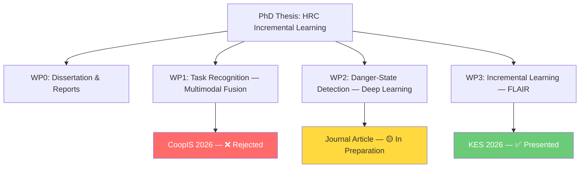
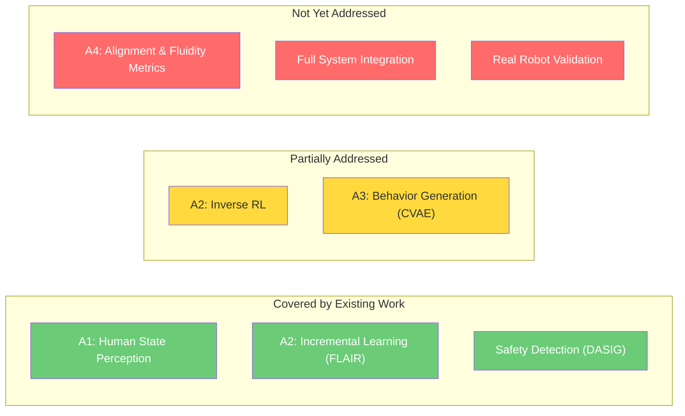
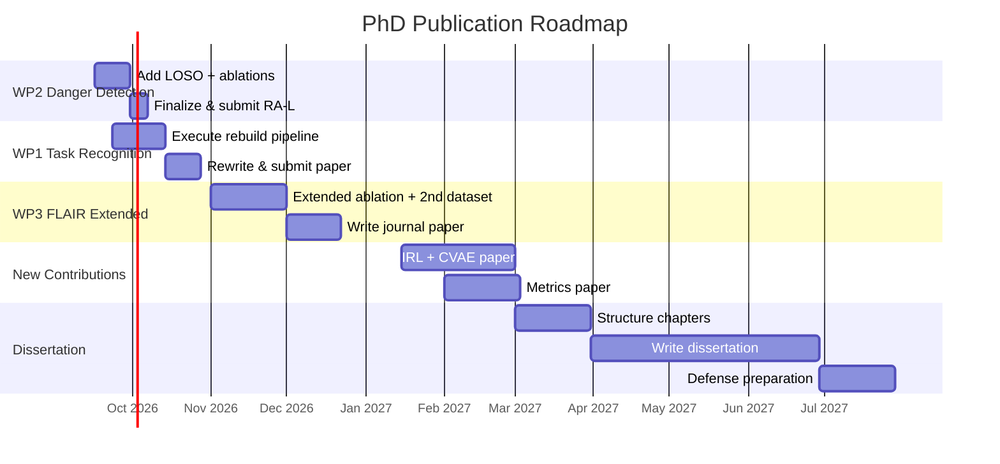

# PhD Thesis — Full Workspace Analysis & Next Steps

**Author:** Ameur Gargouri
**Thesis:** *Collaboration Humain-Robot : Apprentissage incrémental et adaptation comportementale*
**Labs:** ATISP (University of Sfax, Tunisia) & ESME Research Lab (France)
**Analysis Date:** September 15, 2026

---

## 1. Workspace Overview

Your workspace is **well-organized** into 4 self-contained research work packages (WPs), each with a uniform `src/`, `assets/`, `output/`, `paper/` structure. The codebase covers 3 public datasets (HARMONIC, DASIG, MultiPhysio-HRC), 3 core research contributions, and extensive experimental artifacts.

---

## 2. Research Work Package Status

### 📊 Status Summary Table

| WP | Title | Dataset | Best Result | Paper Status | Maturity |
|----|-------|---------|-------------|-------------|----------|
| **WP1** | Task Recognition (Multimodal Fusion) | MultiPhysio-HRC (55 subj.) | 93.7% acc / 0.914 F1 (inflated) → **~0.56 F1 honest LOSO** | ❌ CoopIS rejected | 🔴 Needs major rebuild |
| **WP2** | Danger-State Detection (1D DL) | DASIG (60 subj.) | 98.68% F1 (ConvNeXt 1D) | 🟡 Multi-format drafts ready (Elsevier CAS, Springer, Robotica, IEEE LRA) | 🟢 Ready to submit |
| **WP3** | Incremental Learning (FLAIR) | HARMONIC (24 subj.) | R²=0.690 (beats Joint Training 0.644) | ✅ Presented at KES 2026 | 🟢 Published |
| **WP0** | Dissertation & Reports | — | — | 6 progress reports + LaTeX thesis draft (7 chapters) | 🟡 In progress |

> [!NOTE]
> A prior publication exists: **MDPI Machines** (Nov 2025) on an autonomous mobile robot under ROS 2 (DOI: 10.3390/machines13111044). This counts as your 1st peer-reviewed journal paper.

---

## 3. Detailed Work Package Analysis

### 3.1 WP1 — Task Recognition from Multimodal Sensor Fusion

**Paper:** [task_type_detection_paper.tex](file:///home/g0amer/Desktop/thesis/01_Task_Recognition_Multimodal_Fusion/paper/task_type_detection_paper.tex)
**Rejection Plan:** [REJECTION_RESPONSE_PLAN.md](file:///home/g0amer/Desktop/thesis/01_Task_Recognition_Multimodal_Fusion/REJECTION_RESPONSE_PLAN.md)

#### What Was Done
- Multi-modal fusion pipeline: EEG + ECG + EDA + EMG + Respiration
- Benchmark of tabular + neural classifiers (XGBoost, MLP, Two-Tower, etc.)
- LOSO and classic-split evaluations
- 4 paper revisions (`_rev`, `_v3`, `_v4`)

#### Critical Issues Found (Verified)

| Defect | Severity | Description |
|--------|----------|-------------|
| **D1 — Data Leakage** | 🔴 Critical | 80/20 split is row-level, not subject-disjoint → inflated metrics |
| **D2 — Metadata as Features** | 🔴 Critical | `ID__*` and `Repetition__*` columns used as model features |
| **D3 — EEG Duplicates** | 🟠 High | 96 EEG columns exist twice → double-weighted |
| **D4 — Invented Labels** | 🔴 Critical | 5-class labels are keyword-rule-based, not ground truth |
| **D5 — Unreproducible Numbers** | 🔴 Critical | Headline 93.7% from leaky split; honest LOSO ≈ 0.56 F1 |
| **D6–D9** | 🟠 Medium | Figure mismatch, broken refs, no ablation, weak novelty |

> [!WARNING]
> The existing paper numbers are **not publishable**. A complete experimental rebuild is required before resubmission.

#### Rebuild Plan Already Documented
Your [REJECTION_RESPONSE_PLAN.md](file:///home/g0amer/Desktop/thesis/01_Task_Recognition_Multimodal_Fusion/REJECTION_RESPONSE_PLAN.md) is thorough and maps each reviewer comment to a concrete fix. The plan includes: clean dataset construction, full 52-subject LOSO, modality ablation (EEG-only vs. physio-only vs. fused), paired significance testing, and complete paper rewrite.

---

### 3.2 WP2 — Danger-State Detection Using 1D Deep Learning

**Paper:** [cobot_safety_paper.tex](file:///home/g0amer/Desktop/thesis/02_Danger_State_Detection_Deep_Learning/paper/cobot_safety_paper.tex)
**Cover Letter:** [cover_letter_JINT.tex](file:///home/g0amer/Desktop/thesis/02_Danger_State_Detection_Deep_Learning/paper/cover_letter_JINT.tex)
**Results:** [Final_Models_Summary.md](file:///home/g0amer/Desktop/thesis/02_Danger_State_Detection_Deep_Learning/output/Final_Models_Summary.md)

#### Strengths
- ✅ **Exceptional results**: ConvNeXt 1D achieves 98.68% macro-F1, 97.13% danger recall
- ✅ **5 state-of-the-art 1D architectures** benchmarked (ConvNeXt, TCN, MLP-Mixer, Transformer, InceptionTime)
- ✅ **Novel GPU-accelerated kinematic expansion** (65→195 features)
- ✅ **False-alarm reduction of 87.5%** via temporal post-processing
- ✅ **5-fold StratifiedKFold** cross-validation on 69K+ windows
- ✅ **Publication-quality figures** (7 PDFs) and multiple journal-format submissions ready (Elsevier CAS, Springer, Robotica, IEEE LRA)
- ✅ **14 trained model checkpoints** (.pth files)

#### Concerns to Address Before Submission
| Issue | Recommendation |
|-------|---------------|
| Subject-dependent evaluation only | Add **Leave-One-Subject-Out (LOSO)** cross-validation to demonstrate generalization |
| No statistical significance tests | Add **paired bootstrap / Wilcoxon tests** between top models |
| Missing ablation on kinematic expansion | Show 65-ch vs. 195-ch performance gap |
| TTA impact not isolated | Ablation: TTA on vs. off |
| Inference latency not reported | Add wall-clock timing table for real-time deployment claims |
| Multiple submission formats — choose one | Pick **one journal** and finalize |

---

### 3.3 WP3 — FLAIR: Incremental Learning for HRC

**Paper:** [flair_paper.tex](file:///home/g0amer/Desktop/thesis/03_Incremental_Learning_FLAIR/paper/flair_paper.tex)
**Architecture:** [ARCHITECTURE.md](file:///home/g0amer/Desktop/thesis/03_Incremental_Learning_FLAIR/src/ARCHITECTURE.md)

#### Strengths
- ✅ **Presented at KES 2026** — published and presented
- ✅ **Novel algorithm (FLAIR)** beating Joint Training ceiling (R²=0.690 vs. 0.644)
- ✅ **Near-zero forgetting** (F=0.017, 8.8× lower than DER++)
- ✅ **Tiny memory footprint** (1.28 MB)
- ✅ **8 experiments** (exp01–exp07) including ablation studies
- ✅ **Comprehensive modular codebase** (8-layer architecture with IRL, CVAE, safety filters)

#### Gaps & Opportunities
| Gap | Opportunity |
|-----|------------|
| Conference paper (short, limited ablation) | Expand to a **full journal paper** with deeper ablation + larger-scale evaluation |
| Only tested on HARMONIC | Test FLAIR on a **second dataset** for generalizability claims |
| CVAE behavior generation + IRL modules exist in code but no paper | These are **unpublished contributions** worth a dedicated paper |
| ROS 2 integration planned but not implemented | Simulation or real-robot demo would strengthen the thesis |

---

### 3.4 WP0 — Dissertation & Reports

**LaTeX Project:** [main.tex](file:///home/g0amer/Desktop/thesis/00_Thesis_Dissertation_and_Reports/paper/latex_project/main.tex)
**Chapters:** 01_contexte → 07_perspectives

#### Current State
- 7 chapter structure covering context, related work, evolution, research, contributions, progress, perspectives
- 6 periodic progress reports (Jan–Apr 2026)
- Complete thesis synthesis in markdown ([rapport_these_complet.md](file:///home/g0amer/Desktop/thesis/00_Thesis_Dissertation_and_Reports/paper/rapport_these_complet.md))
- Defense presentation slides (Marp-based HTML)
- Written in French (appropriate for co-tutelle Tunisia/France)

> [!IMPORTANT]
> The dissertation is in **progress-report mode**, not yet in **final thesis manuscript mode**. It needs to be restructured into a formal dissertation with full chapters per contribution.

---

## 4. Publication Portfolio

| # | Paper | Venue | Status | Type |
|---|-------|-------|--------|------|
| 1 | Autonomous Mobile Robot (ROS 2 + YOLO11n) | MDPI Machines (2025) | ✅ Published | Journal |
| 2 | Task Recognition — Multimodal Fusion | CoopIS 2026 | ❌ Rejected | Conference |
| 3 | Danger-State Detection — 1D Deep Learning | TBD (Elsevier/IEEE/Robotica) | 🟡 Ready to submit | Journal |
| 4 | FLAIR — Incremental Learning | KES 2026 | ✅ Published | Conference |

**Current score: 1 journal + 1 conference published**

---

## 5. Gap Analysis

| Thesis Axis | Coverage | Evidence |
|------------|----------|----------|
| A1 — Modeling human operational schemas | 🟢 Good | WP1 (physiological task recognition) + WP2 (kinematic danger detection) |
| A2 — Incremental IRL | 🟡 Partial | FLAIR algorithm published; IRL modules exist in code but untested/unpublished |
| A3 — Personalized behavior generation | 🟡 Partial | CVAE, DMP, temporal scheduler modules exist in code, no publication |
| A4 — Alignment & fluidity metrics | 🔴 Missing | Metrics module exists as stubs; no experimental validation |

---

## 6. Recommended Next Steps — Research Action Plan

### Phase 1: Immediate Priority (September–October 2026) — **Paper Submissions**

#### 6.1 🔥 Submit WP2 Danger-State Detection Journal Paper

> [!TIP]
> This is your **lowest-hanging fruit** — the results are strong and the paper is essentially written in multiple formats.

**Actions:**
1. **Choose target journal** — recommended: **IEEE Robotics and Automation Letters (RA-L)** (fast review cycle ~3 months, high impact in robotics + safety, IF ≈ 5.2)
   - Alternative: *Journal of Intelligent & Robotic Systems (JINT)* or *Robotica* for broader scope
2. **Add LOSO cross-validation** (critical for generalization claim) — use the existing 60-subject split
3. **Add ablation table**: (a) 65-ch vs. 195-ch, (b) TTA on/off, (c) post-processing on/off
4. **Add significance testing** (paired bootstrap across folds)
5. **Report inference latency** per architecture (ms/window)
6. **Finalize the IEEE LRA format** ([cobot_safety_lra/](file:///home/g0amer/Desktop/thesis/02_Danger_State_Detection_Deep_Learning/paper/cobot_safety_lra)) and submit

**Estimated effort:** 2–3 weeks
**Expected outcome:** 1 journal paper submitted (→ potential acceptance ~Dec 2026)

---

#### 6.2 🔧 Rebuild & Resubmit WP1 Task Recognition Paper

**Actions (following your [REJECTION_RESPONSE_PLAN.md](file:///home/g0amer/Desktop/thesis/01_Task_Recognition_Multimodal_Fusion/REJECTION_RESPONSE_PLAN.md)):**
1. Execute `rebuild/build_clean_dataset.py` — drop leaked features, deduplicate EEG
2. Run full 52-subject LOSO with clean feature set (~128 features)
3. Perform modality ablation (EEG-only, physio-only, fused)
4. Compute paired significance tests
5. Rewrite paper with honest numbers (F1 ≈ 0.5–0.6) — **reframe**: "cross-subject generalization is hard; this is the finding"
6. **Target venue**: **Sensors** (MDPI, open access, moderate review cycle) or **IEEE Transactions on Affective Computing** (higher impact, longer review)

**Estimated effort:** 4–5 weeks
**Expected outcome:** 1 resubmitted paper

---

### Phase 2: New Contributions (November–December 2026) — **Expand FLAIR**

#### 6.3 📝 Expand FLAIR to a Full Journal Paper

The KES 2026 paper is a **short conference paper**. Expand it to a full journal article:

**New content to add:**
1. **Extended ablation study**: systematically evaluate each FLAIR component (FiLM, replay, Fisher, RetroBoost, warm-start, adaptive weighting) — you already have exp01–exp07
2. **Second dataset evaluation**: apply FLAIR to the **MultiPhysio-HRC** or **DASIG** dataset for generalizability
3. **Scalability analysis**: vary number of sequential tasks (5, 10, 15, 20) and plot degradation curves
4. **Comparison with more baselines**: add LwF, SI, MAS, PackNet, ProgressiveNets (code stubs exist in your `regularization_based/` and `adapter_based/` modules)
5. **Theoretical analysis**: derive forgetting bound for FLAIR's combined regularization

**Target venue:** **Neural Networks** (Elsevier, IF ≈ 7.8), **Pattern Recognition** (IF ≈ 8.0), or **Robotics and Autonomous Systems** (IF ≈ 4.3)

**Estimated effort:** 6–8 weeks
**Expected outcome:** 1 high-impact journal paper

---

### Phase 3: Novel Contributions (January–March 2027) — **Fill the Gaps**

#### 6.4 📝 Paper 5: IRL + CVAE for Personalized Robot Behavior Generation

You have **implemented but unpublished** IRL and CVAE modules in [src/irl/](file:///home/g0amer/Desktop/thesis/03_Incremental_Learning_FLAIR/src/src/irl) and [src/behavior_generation/](file:///home/g0amer/Desktop/thesis/03_Incremental_Learning_FLAIR/src/src/behavior_generation).

**Paper concept:**
- Online Inverse RL to learn per-operator reward functions from corrections
- Style-conditioned CVAE to generate personalized robot trajectories
- Evaluation on HARMONIC dataset with personalization metrics

**Target venue:** **IEEE ICRA 2027** or **IEEE/RSJ IROS 2027** (top robotics conferences, deadlines typically Feb/Jul)

#### 6.5 📝 Paper 6: Alignment & Fluidity Metrics for HRC

**Address thesis Axis A4** — the currently empty axis:
- Define formal metrics: joint-action entropy, workspace overlap rate, mutual idle time
- Validate on HARMONIC shared-autonomy data
- Correlate with subjective user satisfaction

**Target venue:** **HRI 2027** (ACM/IEEE Human-Robot Interaction, deadline ~Oct 2026) or journal special issue

---

### Phase 4: Thesis Manuscript (March–June 2027) — **Final Dissertation**

#### 6.6 📖 Structure the Final Dissertation

Restructure from progress-report mode to formal thesis:

| Chapter | Content | Source |
|---------|---------|--------|
| 1. Introduction | Problem statement, research questions, thesis outline | New |
| 2. State of the Art | HRC, incremental learning, physiological sensing, safety | Existing surveys |
| 3. Task Recognition (WP1) | Rebuilt evaluation, modality analysis | WP1 journal paper |
| 4. Danger-State Detection (WP2) | 1D DL architectures, kinematic expansion, post-processing | WP2 journal paper |
| 5. FLAIR Algorithm (WP3) | Full algorithm, ablation, multi-dataset eval | Expanded FLAIR journal paper |
| 6. System Integration | 8-layer architecture, IRL + CVAE, alignment metrics | WP3 code + papers 5–6 |
| 7. Conclusion & Perspectives | Summary, limitations, future work | New |

---

## 7. Recommended Publication Timeline

---

## 8. Target Publication Portfolio at Defense

| # | Paper | Venue Type | Target | Status |
|---|-------|-----------|--------|--------|
| 1 | Mobile Robot (ROS 2) | Journal | MDPI Machines ✅ | Published |
| 2 | Danger-State Detection | Journal | IEEE RA-L | To submit (Oct 2026) |
| 3 | Task Recognition (rebuilt) | Journal | Sensors / IEEE TAC | To resubmit (Nov 2026) |
| 4 | FLAIR (conference) | Conference | KES 2026 ✅ | Published |
| 5 | FLAIR (extended) | Journal | Neural Networks / PR | To submit (Jan 2027) |
| 6 | IRL + CVAE | Conference | ICRA / IROS 2027 | To write (Q1 2027) |
| 7 | Alignment Metrics | Conference/Journal | HRI / RAS | To write (Q1 2027) |

**Target at defense: 3–4 journals + 2–3 conferences** — a very strong portfolio for a Franco-Tunisian co-tutelle PhD.

---

## 9. Technical Debt & Housekeeping

| Item | Location | Action |
|------|----------|--------|
| Leftover build artifacts | `paper/*.aux, *.log, *.fls, *.fdb_latexmk` everywhere | Add to `.gitignore` |
| `cobot_safety_paper copy.*` files | [WP2 paper/](file:///home/g0amer/Desktop/thesis/02_Danger_State_Detection_Deep_Learning/paper) | Delete copies, keep versioned originals |
| Adapter module empty | [adapter_based/](file:///home/g0amer/Desktop/thesis/03_Incremental_Learning_FLAIR/src/src/incremental_learning/adapter_based) | Implement or remove placeholder |
| Side explorations | [shoplifting/](file:///home/g0amer/Desktop/thesis/00_Thesis_Dissertation_and_Reports/src/shoplifting/), [dataset-ninja/](file:///home/g0amer/Desktop/thesis/00_Thesis_Dissertation_and_Reports/src/dataset-ninja/) | Archive or remove |
| Virtual env as symlink | `.venv` file (35 bytes) | Verify it resolves correctly |
| Lock file in paper/ | `.~lock.4th_research_thesis .docx#` | Remove (LibreOffice artifact) |

---

## 10. Key Recommendations Summary

> [!IMPORTANT]
> **Top 3 actions to take this week:**
>
> 1. **Submit WP2** (danger detection) to IEEE RA-L — your strongest and most mature work
> 2. **Start the WP1 rebuild pipeline** — execute `build_clean_dataset.py` and `loso_benchmark.py`
> 3. **Pick a target journal** for the FLAIR extended paper and outline the new experiments

> [!TIP]
> Your rejection response plan for WP1 is excellent — it's one of the most thorough self-audits I've seen. The key insight is to **embrace the honest LOSO numbers** (~0.56 F1) and reframe the story: cross-subject physiological state recognition is genuinely difficult, and documenting that difficulty with a rigorous protocol is itself a contribution.
