# 🏭 Cobot Safety-State Detection — Full Pipeline Architecture

> Deep Learning Pipeline v4 — Factory-Calibrated (Subject-Dependent) Benchmark

---

## 1. End-to-End Pipeline Overview

```mermaid
flowchart LR
    A["🦾 Raw IMU\nSensors\n60 Subjects"] --> B["📦 Data Loading\n& Labelling"]
    B --> C["✂️ Windowing\n& Normalisation"]
    C --> D["🔀 StratifiedKFold\n5-Fold CV"]
    D --> E["🧠 GPU Training\nLoop"]
    E --> F["📊 Validation\n& TTA"]
    F --> G["⚙️ Post-Processing\nSmoothing + Threshold"]
    G --> H["✅ Final\nPrediction\nSAFE / DANGER"]

    style A fill:#1a1a2e,stroke:#e94560,color:#fff
    style B fill:#16213e,stroke:#0f3460,color:#fff
    style C fill:#16213e,stroke:#0f3460,color:#fff
    style D fill:#0f3460,stroke:#53a8b6,color:#fff
    style E fill:#e94560,stroke:#fff,color:#fff
    style F fill:#0f3460,stroke:#53a8b6,color:#fff
    style G fill:#533483,stroke:#e94560,color:#fff
    style H fill:#2b9348,stroke:#fff,color:#fff
```

---

## 2. Data Ingestion & Labelling

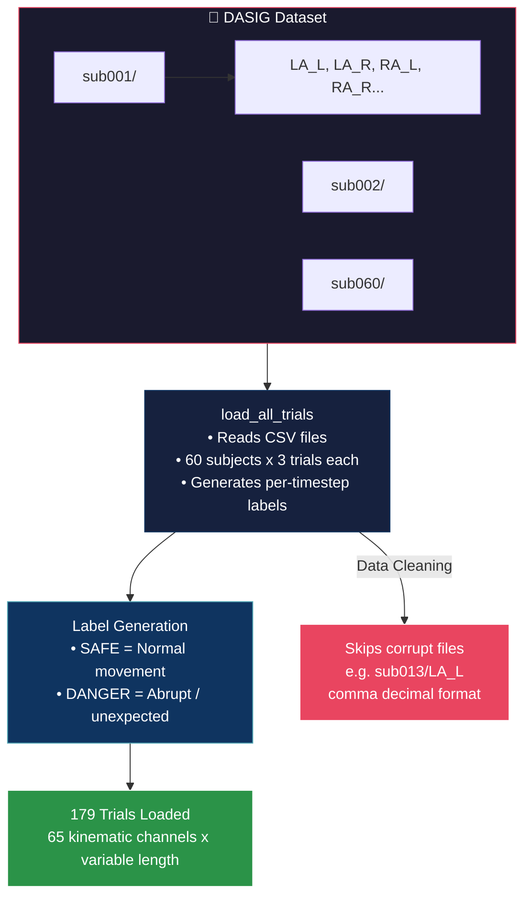

| Parameter | Value |
|---|---|
| Sensor Channels | **65** (joint angles, positions, orientations) |
| Sampling Rate | **200 Hz** |
| Total Subjects | **60** |
| Total Trials | **179** |

---

## 3. Windowing & Normalisation

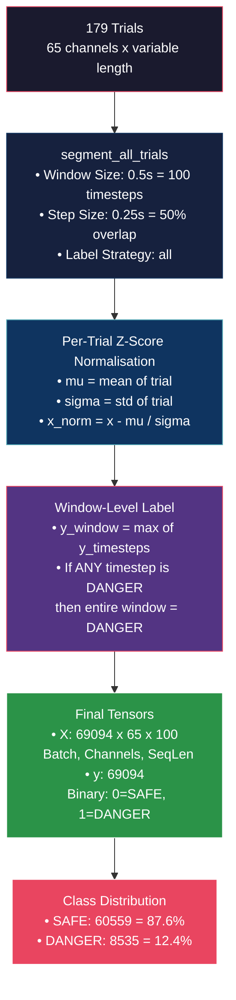

---

## 4. Dynamic Feature Engineering (On-GPU)

To prevent OOM crashes, velocity and acceleration derivatives are computed **dynamically inside the training loop on the GPU** rather than being pre-computed in RAM.

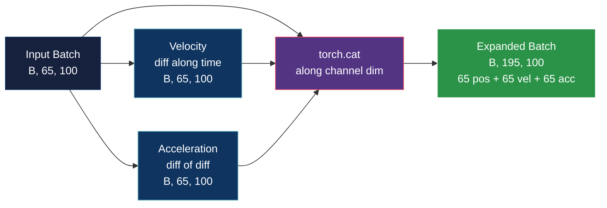

| Feature Group | Channels | Description |
|---|---|---|
| Position (raw) | 65 | Original kinematic channels |
| Velocity (1st derivative) | 65 | Rate of change of position |
| Acceleration (2nd derivative) | 65 | Jerk detection |
| **Total** | **195** | Fed into every model |

---

## 5. Cross-Validation Strategy

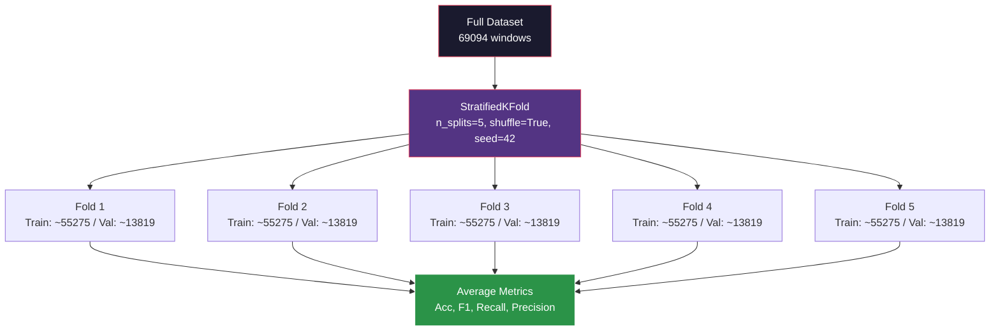

> [!IMPORTANT]
> **Subject-Dependent (Factory-Calibrated):** StratifiedKFold allows the model to see portions of every subject's data during training. This simulates a real factory where the cobot is calibrated to the specific workers on that floor.

---

## 6. Training Loop Architecture

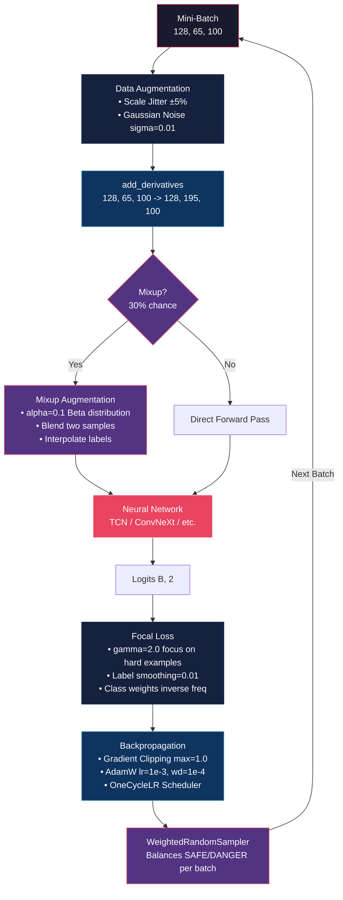

| Training Hyperparameter | Value |
|---|---|
| Epochs | 30 |
| Batch Size | 128 |
| Optimizer | AdamW (lr=1e-3, weight_decay=1e-4) |
| Scheduler | OneCycleLR (max_lr=2e-3) |
| Loss Function | Focal Loss (gamma=2.0, smoothing=0.01) |
| Gradient Clipping | max_norm=1.0 |
| Mixup Probability | 30% |
| Mixup Alpha | 0.1 |

---

## 7. Model Architectures

### 7.1 TCN (Temporal Convolutional Network) — Best Overall

```mermaid
flowchart LR
    IN["Input\nB, 195, 100"] --> PROJ["Conv1d 1x1\n195 to 256\n+ BN + GELU"]
    PROJ --> B1["TCNBlock\nd=1"]
    B1 --> B2["TCNBlock\nd=2"]
    B2 --> B3["TCNBlock\nd=4"]
    B3 --> B4["TCNBlock\nd=8"]
    B4 --> B5["TCNBlock\nd=16"]
    B5 --> B6["TCNBlock\nd=32"]
    B6 --> GAP["AdaptiveAvgPool1d\nB, 256, 1"]
    GAP --> DROP["Dropout 0.2"]
    DROP --> FC["Linear\n256 to 2"]
    FC --> OUT["SAFE / DANGER"]

    style IN fill:#1a1a2e,stroke:#e94560,color:#fff
    style PROJ fill:#16213e,stroke:#0f3460,color:#fff
    style B6 fill:#0f3460,stroke:#53a8b6,color:#fff
    style GAP fill:#533483,stroke:#e94560,color:#fff
    style OUT fill:#2b9348,stroke:#fff,color:#fff
```

**TCNBlock (Residual):**
```
Input ---+--- Conv1d(k=3, dilation=d) -> BN -> GELU -> Conv1d(k=3, dilation=d) -> BN -> GELU ---+--- GELU -> Output
         |                                                                                       |
         +--------------------------------------- Residual Skip --------------------------------+
```

### 7.2 ConvNeXt 1D

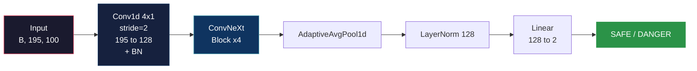

**ConvNeXtBlock (Inverted Bottleneck):**
```
Input ---+--- DWConv1d(k=7, groups=dim) -> LayerNorm -> Linear(dim to 4*dim) -> GELU -> Linear(4*dim to dim) ---+--- Output
         |                                                                                                       |
         +------------------------------------------ Residual Skip ---------------------------------------------+
```

### 7.3 MLP-Mixer 1D

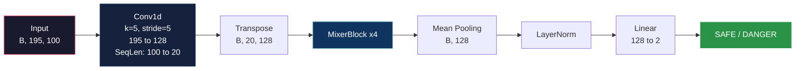

**MixerBlock:**
```
Input ---+--- LayerNorm -> Transpose -> Linear(20 to 40) -> GELU -> Linear(40 to 20) -> Transpose ---+--- (Token Mixing)
         |                                                                                            |
         +-------------------------------------- Residual -------------------------------------------+
      ---+--- LayerNorm -> Linear(128 to 256) -> GELU -> Linear(256 to 128) ---+--- (Channel Mixing) -> Output
         |                                                                      |
         +--------------------------- Residual --------------------------------+
```

### 7.4 Transformer 1D

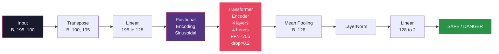

### 7.5 InceptionTime

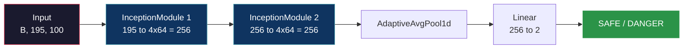

**InceptionModule (Multi-Scale):**
```
Input ---+--- Conv1d(k=1) ----------------------------------+
         |                                                   |
         +--- Conv1d(k=3, pad=1) ----------------------------+--- Concatenate -> BatchNorm -> GELU -> Output
         |                                                   |
         +--- Conv1d(k=5, pad=2) ----------------------------+
         |                                                   |
         +--- MaxPool1d(k=3, pad=1) -> Conv1d(k=1) ---------+
```

---

## 8. Validation & Test-Time Augmentation (TTA)

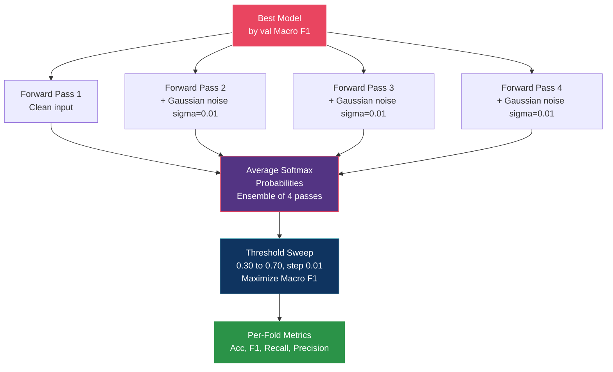

---

## 9. Post-Processing Pipeline (Production Deployment)

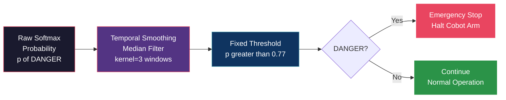

**Impact of Post-Processing:**

| Metric | Raw Model | + Smoothing + Threshold 0.77 |
|---|---|---|
| Danger Precision | 83.92% | **95.09%** |
| Danger Recall | 82.84% | **98.44%** |
| False Positives | ~1,324 | **434** (-67%) |
| False Negatives | ~142 | **133** (-6%) |

---

## 10. Complete Data Flow Summary

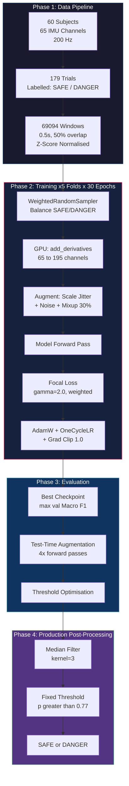

---

## 11. Final Model Rankings

| Rank | Model | Accuracy | Macro F1 | Danger Recall | Danger Precision |
|---|---|---|---|---|---|
| 1 | **TCN** | 99.22% | 97.88% | 98.34% | 95.09% |
| 2 | **ConvNeXt 1D** | 99.17% | 97.76% | 97.84% | 95.62% |
| 3 | **MLP-Mixer 1D** | 99.28% | 97.34% | 95.87% | 95.49% |
| 4 | **InceptionTime** | 98.30% | 96.22% | 97.53% | 89.62% |
| 5 | **Transformer 1D** | 96.47% | 92.50% | 95.85% | 79.71% |

> [!NOTE]
> Rankings are based on the **0.77 threshold + Median Filter** post-processing configuration. All metrics are computed over the full 69,094-window dataset using saved best weights from 5-fold cross-validation.
